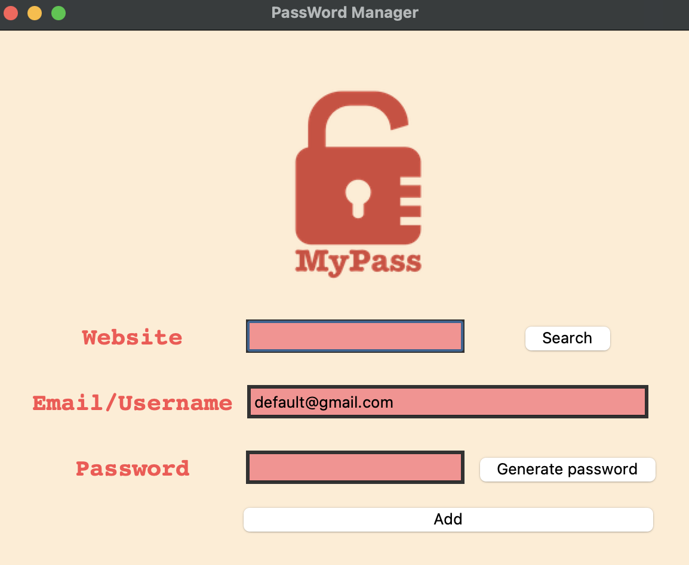
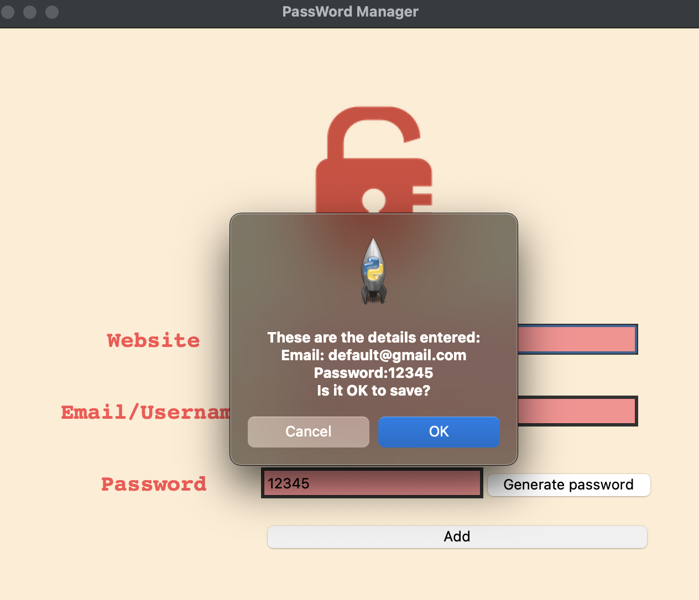
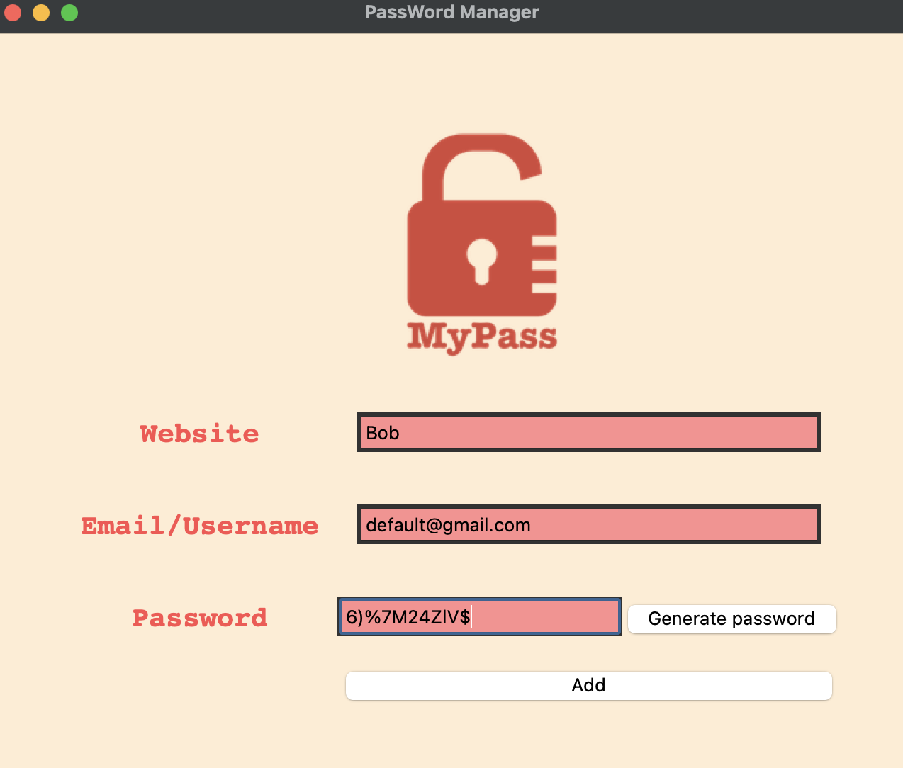
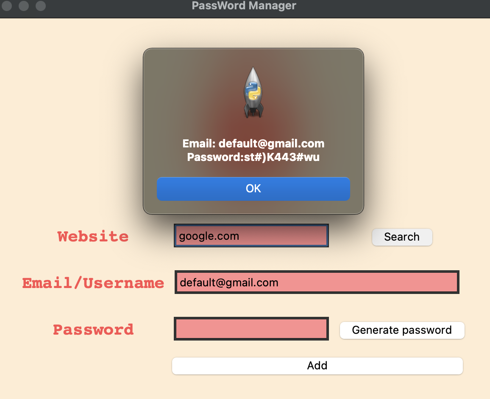
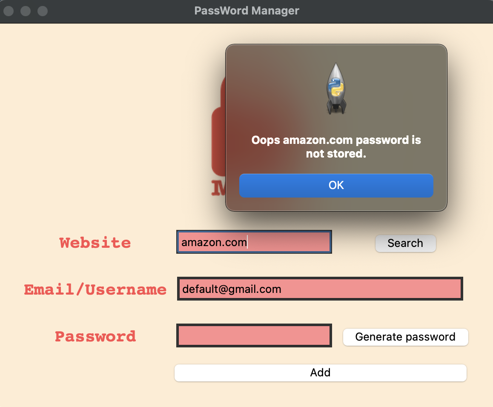

# Password Management System App

Built on tkinter library on Python3

# Functionality

Save a Websites Email/User and Password.

Generate button creates totally random secure passwords. 

Saves user's entries to local file in CSV format.

Search for record of password on CSV and displays it to user. 

## Start Screen 

Write information to save in file. 

## Confirm Screen 

After clicking on Add, pop up waits for user to confirm. 

## Generate Password

Generates random password with letters, symbols, and numbers.

## Search Website Password

Looks up record from website entry and displays results to user.

When stored the following pop-up shows.

If website record doesn't exist

