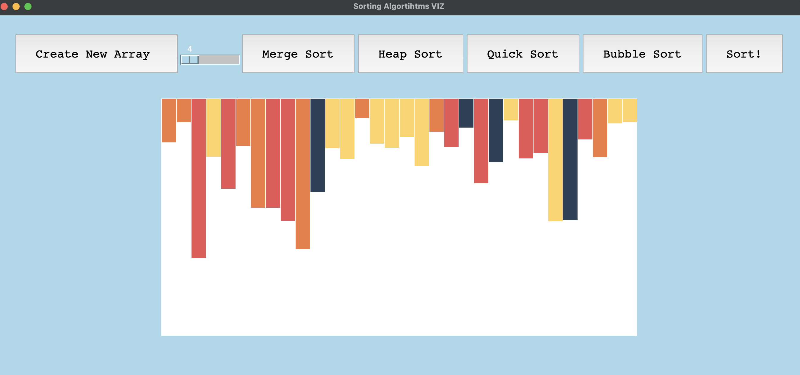

# Sorting Visualizer project 

# Progress

## Feb/17

Implement GUI with Tkinter library

# Sorting Algorithms
1) Merge Sort
2) Heap Sort 
3) Quick Sort 
4) Bubble Sort 

# Development Steps 
1) Make GUI to visualize and components functionality
2) Sorting algorithm implementation 1 through 4 
3) New Array: Random, Nearly Sorted, Sorted
