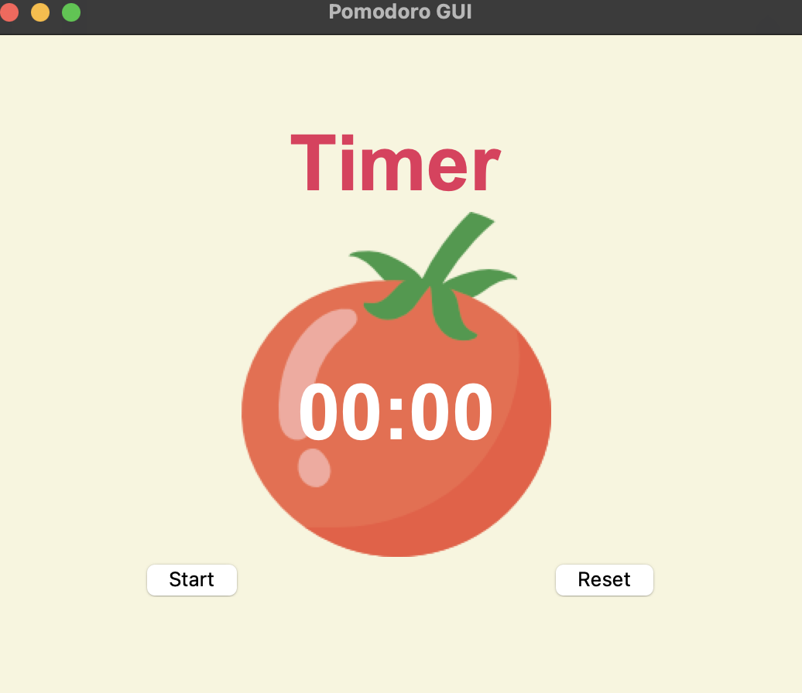
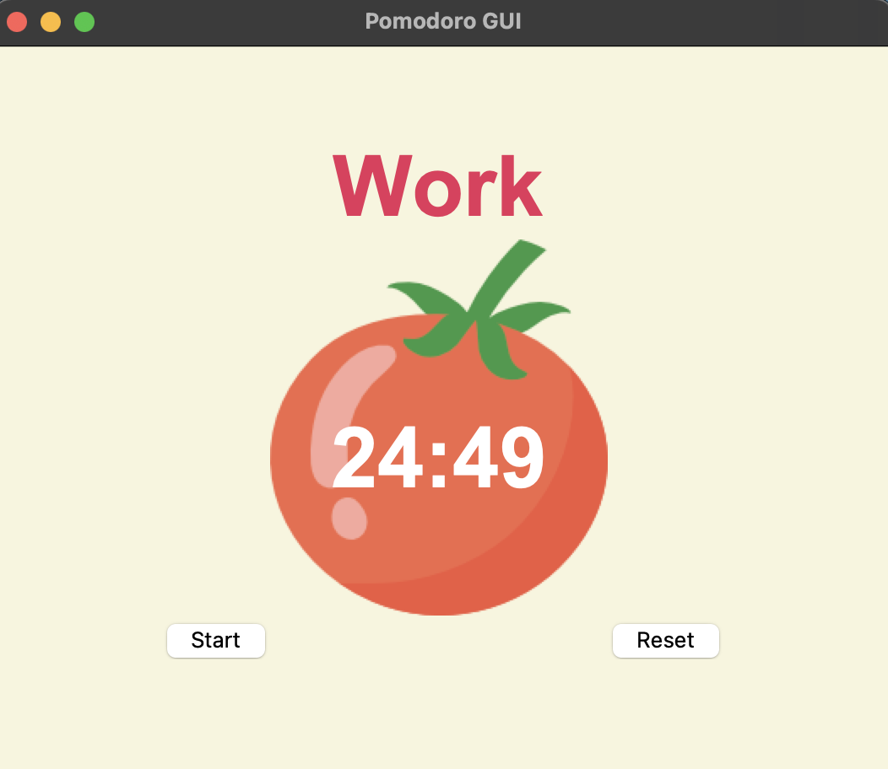
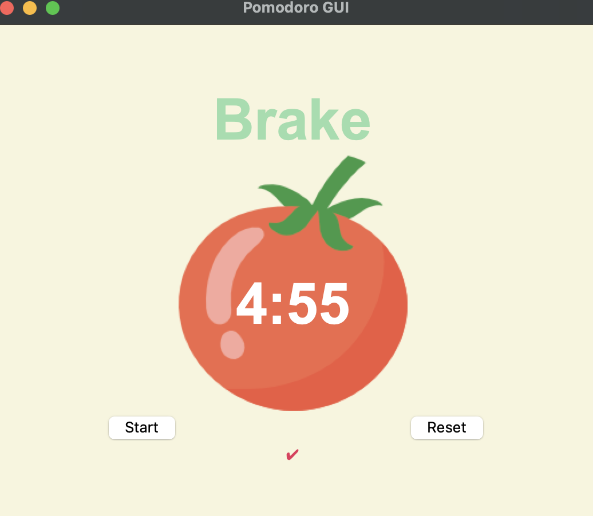

# Time Management System App

Based on tkinter library on Python3

# Functionality

4 periods of 25 minutes of Work.

3 short brakes of 5 minutes each and one long brake of 20 minutes.

For a total Amount of work of 1.50 hours of total work.

2 buttons: one to start countdown, the other to reset it.

# Pomodoro Cycle Illustrated

# Start Screen 

Click on the "start" button to fire count down.

# Work Screen 

After each Work period one check mark is displayed.

# Brake Screen

Time to relax before more work

# Reset

Click on the "reset" button to go back to the Start Screen
